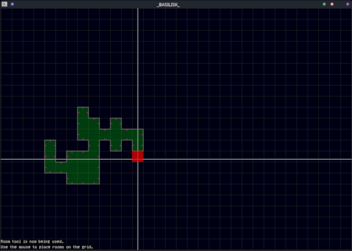
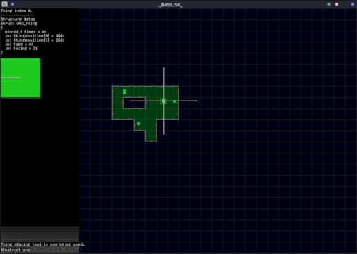
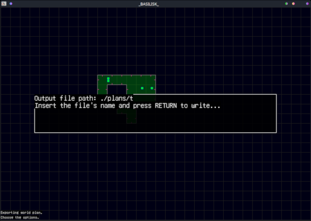
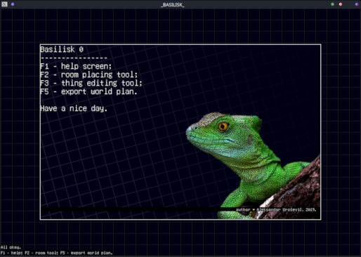

# Basilisk

## Description

Basilisk is a software for creating map files to be used by [Wyvern software](https://pages.github.com/).

## Features

### Room placing

A room is simple rectangle of a fixed size. All rooms in the world should be
connected.



### Thing placing

A Thing is an object in the world. Things have changable properties such as position, facing direction, type and flags.

The side menu can be shown an hidden on demand to help editing or selecting.



### Export

Exporting the world file to the defined format can easily be done by pressing the appropriate shortcut key.





## World plan file format

```
todo
```


